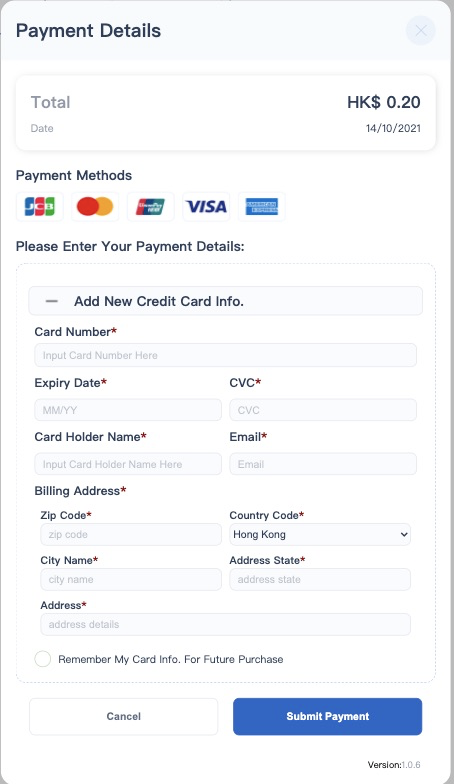
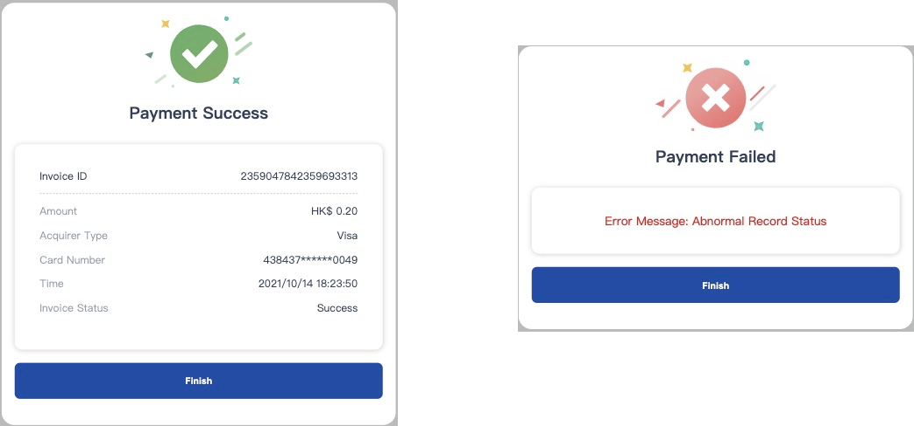

# Revision History 

|  Version   | Date/Author  | Updates | 
|  ----  | ----  |----  |
| V1.0  | Oct.11, 2021 | First Draft|
|    |  |  |

# Abstract
The JS SDK is provided for customers to access the Bindo Payment Gateway faster. Developers don’t need to understand the payment protocol, but only need to integrate with JS SDK.The chapter describes the JS SDK online payment service.

<aside class="notice">
The domain in the merchant  information profile applied  must be the same as the JS SDK integration
</aside>

Key Benefits:

1. Fast setup & integration.
1. Very secure.
1. PCIDSS requirements and compliances are handled by JS SDK.


# Data Flow


![](https://mermaid.ink/img/eyJjb2RlIjoic2VxdWVuY2VEaWFncmFtXG4gICAgcGFydGljaXBhbnQgVGhpcmQgIGFzIFRoaXJkIFBhcnR5IFNlcnZlclxuICAgIHBhcnRpY2lwYW50IFUgYXMgV2ViIENsaWVudFxuICAgIHBhcnRpY2lwYW50IEpTIGFzIEpTIFNES1xuICBcbiAgICBcbiAgICBwYXJ0aWNpcGFudCBCaW5kbyBhcyBCaW5kbyBTZXJ2ZXJcbiAgICBwYXJ0aWNpcGFudCBCIGFzIEJhbmtcbiAgICBcbiAgICBcbiAgICBVLT4-VTogU2hvcHBpbmcgb25saW5lXG4gICAgVS0-PlU6IENvbmZpcm0gT2xpbmUgU2hvcHBpbmcgb3JkZXIgQW5kIFBheW1lbnRcbiAgICBVLT4-VGhpcmQ6IE9ubGluZSBTaG9wcGluZyBPcmRlciBQcm9jZXNzaW5nIFJlcXVlc3RcbiAgICBUaGlyZC0-PkJpbmRvOlByZS1DcmVhdGUgUmVxdWVzdCBcbiAgICBCaW5kby0tPj5UaGlyZDogUmVzcG9uc2UgICBcInBheV9yZWRpcmVjdF91cmxcIlxuICAgIFRoaXJkLT4-VTogXCJwYXlfcmVkaXJlY3RfdXJsXCJcbiAgICBVLT4-SlM6IFBheW1lbnQgUmVxdWVzdCBCeSBQYXkgUmVkaXJlY3QgVVJMXG4gICAgSlMtPj5CaW5kbzogR2V0IE9wdGlvbnMgQnkgUGF5IFJlZGlyZWN0IFVSTFxuICAgIEJpbmRvLS0-PkpTOiBQYXltZW50IERldGFpbFxuICAgIEpTLT4-SlM6IFNob3cgUGF5bWVudCBEZXRhaWxcbiAgICBKUy0-PkpTOiBJbnB1dCBDYXJkIGluZm8uIEFuZCBDb25maXJtIFRvIFBheVxuICAgIEpTLT4-QmluZG86IFBheW1lbnQgUmVxdWVzdFxuICAgIEJpbmRvLT4-QjogUGF5bWVudCBSZXF1ZXN0XG4gICAgQi0tPj5CaW5kbzogUGF5bWVudCBSZXN1bHRcbiAgICBcbiAgICBCaW5kby0-PkpTOiBQYXltZW50IFJlc3VsdFxuICAgIFxuICAgIEpTLT4-SlM6IFNob3cgUGF5bWVudCBSZXN1bHRcbiAgICBKUy0-PlU6UmVzcG9uc2UgUGF5bWVudCBSZXN1bHRcbiAgIFxuICAgIFRoaXJkLT4-QmluZG86UXVlcnkgUGF5bWVudCBSZXNjdWx0XG4gICAgQmluZG8tLT4-VGhpcmQ6UmVzcG9uc2UgVHJhbnNhY3Rpb24gUmVzdWx0IiwibWVybWFpZCI6eyJ0aGVtZSI6ImRlZmF1bHQiLCJ0aGVtZVZhcmlhYmxlcyI6eyJiYWNrZ3JvdW5kIjoid2hpdGUiLCJwcmltYXJ5Q29sb3IiOiIjRUNFQ0ZGIiwic2Vjb25kYXJ5Q29sb3IiOiIjZmZmZmRlIiwidGVydGlhcnlDb2xvciI6ImhzbCg4MCwgMTAwJSwgOTYuMjc0NTA5ODAzOSUpIiwicHJpbWFyeUJvcmRlckNvbG9yIjoiaHNsKDI0MCwgNjAlLCA4Ni4yNzQ1MDk4MDM5JSkiLCJzZWNvbmRhcnlCb3JkZXJDb2xvciI6ImhzbCg2MCwgNjAlLCA4My41Mjk0MTE3NjQ3JSkiLCJ0ZXJ0aWFyeUJvcmRlckNvbG9yIjoiaHNsKDgwLCA2MCUsIDg2LjI3NDUwOTgwMzklKSIsInByaW1hcnlUZXh0Q29sb3IiOiIjMTMxMzAwIiwic2Vjb25kYXJ5VGV4dENvbG9yIjoiIzAwMDAyMSIsInRlcnRpYXJ5VGV4dENvbG9yIjoicmdiKDkuNTAwMDAwMDAwMSwgOS41MDAwMDAwMDAxLCA5LjUwMDAwMDAwMDEpIiwibGluZUNvbG9yIjoiIzMzMzMzMyIsInRleHRDb2xvciI6IiMzMzMiLCJtYWluQmtnIjoiI0VDRUNGRiIsInNlY29uZEJrZyI6IiNmZmZmZGUiLCJib3JkZXIxIjoiIzkzNzBEQiIsImJvcmRlcjIiOiIjYWFhYTMzIiwiYXJyb3doZWFkQ29sb3IiOiIjMzMzMzMzIiwiZm9udEZhbWlseSI6IlwidHJlYnVjaGV0IG1zXCIsIHZlcmRhbmEsIGFyaWFsIiwiZm9udFNpemUiOiIxNnB4IiwibGFiZWxCYWNrZ3JvdW5kIjoiI2U4ZThlOCIsIm5vZGVCa2ciOiIjRUNFQ0ZGIiwibm9kZUJvcmRlciI6IiM5MzcwREIiLCJjbHVzdGVyQmtnIjoiI2ZmZmZkZSIsImNsdXN0ZXJCb3JkZXIiOiIjYWFhYTMzIiwiZGVmYXVsdExpbmtDb2xvciI6IiMzMzMzMzMiLCJ0aXRsZUNvbG9yIjoiIzMzMyIsImVkZ2VMYWJlbEJhY2tncm91bmQiOiIjZThlOGU4IiwiYWN0b3JCb3JkZXIiOiJoc2woMjU5LjYyNjE2ODIyNDMsIDU5Ljc3NjUzNjMxMjglLCA4Ny45MDE5NjA3ODQzJSkiLCJhY3RvckJrZyI6IiNFQ0VDRkYiLCJhY3RvclRleHRDb2xvciI6ImJsYWNrIiwiYWN0b3JMaW5lQ29sb3IiOiJncmV5Iiwic2lnbmFsQ29sb3IiOiIjMzMzIiwic2lnbmFsVGV4dENvbG9yIjoiIzMzMyIsImxhYmVsQm94QmtnQ29sb3IiOiIjRUNFQ0ZGIiwibGFiZWxCb3hCb3JkZXJDb2xvciI6ImhzbCgyNTkuNjI2MTY4MjI0MywgNTkuNzc2NTM2MzEyOCUsIDg3LjkwMTk2MDc4NDMlKSIsImxhYmVsVGV4dENvbG9yIjoiYmxhY2siLCJsb29wVGV4dENvbG9yIjoiYmxhY2siLCJub3RlQm9yZGVyQ29sb3IiOiIjYWFhYTMzIiwibm90ZUJrZ0NvbG9yIjoiI2ZmZjVhZCIsIm5vdGVUZXh0Q29sb3IiOiJibGFjayIsImFjdGl2YXRpb25Cb3JkZXJDb2xvciI6IiM2NjYiLCJhY3RpdmF0aW9uQmtnQ29sb3IiOiIjZjRmNGY0Iiwic2VxdWVuY2VOdW1iZXJDb2xvciI6IndoaXRlIiwic2VjdGlvbkJrZ0NvbG9yIjoicmdiYSgxMDIsIDEwMiwgMjU1LCAwLjQ5KSIsImFsdFNlY3Rpb25Ca2dDb2xvciI6IndoaXRlIiwic2VjdGlvbkJrZ0NvbG9yMiI6IiNmZmY0MDAiLCJ0YXNrQm9yZGVyQ29sb3IiOiIjNTM0ZmJjIiwidGFza0JrZ0NvbG9yIjoiIzhhOTBkZCIsInRhc2tUZXh0TGlnaHRDb2xvciI6IndoaXRlIiwidGFza1RleHRDb2xvciI6IndoaXRlIiwidGFza1RleHREYXJrQ29sb3IiOiJibGFjayIsInRhc2tUZXh0T3V0c2lkZUNvbG9yIjoiYmxhY2siLCJ0YXNrVGV4dENsaWNrYWJsZUNvbG9yIjoiIzAwMzE2MyIsImFjdGl2ZVRhc2tCb3JkZXJDb2xvciI6IiM1MzRmYmMiLCJhY3RpdmVUYXNrQmtnQ29sb3IiOiIjYmZjN2ZmIiwiZ3JpZENvbG9yIjoibGlnaHRncmV5IiwiZG9uZVRhc2tCa2dDb2xvciI6ImxpZ2h0Z3JleSIsImRvbmVUYXNrQm9yZGVyQ29sb3IiOiJncmV5IiwiY3JpdEJvcmRlckNvbG9yIjoiI2ZmODg4OCIsImNyaXRCa2dDb2xvciI6InJlZCIsInRvZGF5TGluZUNvbG9yIjoicmVkIiwibGFiZWxDb2xvciI6ImJsYWNrIiwiZXJyb3JCa2dDb2xvciI6IiM1NTIyMjIiLCJlcnJvclRleHRDb2xvciI6IiM1NTIyMjIiLCJjbGFzc1RleHQiOiIjMTMxMzAwIiwiZmlsbFR5cGUwIjoiI0VDRUNGRiIsImZpbGxUeXBlMSI6IiNmZmZmZGUiLCJmaWxsVHlwZTIiOiJoc2woMzA0LCAxMDAlLCA5Ni4yNzQ1MDk4MDM5JSkiLCJmaWxsVHlwZTMiOiJoc2woMTI0LCAxMDAlLCA5My41Mjk0MTE3NjQ3JSkiLCJmaWxsVHlwZTQiOiJoc2woMTc2LCAxMDAlLCA5Ni4yNzQ1MDk4MDM5JSkiLCJmaWxsVHlwZTUiOiJoc2woLTQsIDEwMCUsIDkzLjUyOTQxMTc2NDclKSIsImZpbGxUeXBlNiI6ImhzbCg4LCAxMDAlLCA5Ni4yNzQ1MDk4MDM5JSkiLCJmaWxsVHlwZTciOiJoc2woMTg4LCAxMDAlLCA5My41Mjk0MTE3NjQ3JSkifX0sInVwZGF0ZUVkaXRvciI6ZmFsc2UsImF1dG9TeW5jIjp0cnVlLCJ1cGRhdGVEaWFncmFtIjpmYWxzZX0)


1. Transaction result rely on WebHook mainly, assisted by Query API.
1. We suggest that the interval between calls to the query API is 20 seconds.
1. A pre-create order can only be paid once. If the pre-create order payment failed, it needs to reprocess the pre-create order and pay again


# Bindo Gateway API
The online service system includes a developing and production environment. As result, developers should process the development and testing on the “develop” environment.

The environment is listed below:

|Develop url  | Develop url  | Usage | 
|  :----  | :----  |:----  |
|stg.bindo.co  |bindo.com | Used for login.  {login_url}|
|stg-payment.bindo.co|payment.bindo.co|Used for pre-create, query transaction, etc.  {base_url}|

## Https Headers

Https is used in online Bindo Gateway Service. All the requests are required to send the same header items as below.

Common request header:


|  Parameter | Type  | Usage | Description|
|  :----  | :----  |:----  |:----  |
| Content-Type  | String | M| Constant. Value example: “application/json; charset=UTF-8”|
|X-USER-ACCESS-TOKEN| String | M|Access token, could be null while doing Login.  Value example: “q8s4qg53s8g99grszad9wusds72z9n6”|
| X-CLIENT-IP | String | M|   It is client ip and the field must be required for pre-create api. Pre-create and called JS SDK should be from the same client ip.|


## login
> The Login command request like this:

```json
POST https://stg.bindo.co/api/v2/login     
Request headers:
Content-Type: application/json; charset=UTF-8

Request body:
{
	
   "username":"abcdtest@bindo.com",
	"password":"123456",
	"grant_type":"password",
	"client_id":"hy89x4gh7b82y9ymhl7s75ucog6j9b",
	"client_secret":"acp02fndjef4ablir1ug1imy6ao6cgm"
	
}
```
> The Login command response like this:

```json
Response headers:
HTTP/1.1 200 OK
Content-Type: application/json; charset=utf-8
...
Response body：
{
    "user": {
        "belongs_to_courier": false,
        "is_staff": true,
        "belongs_to_internal": false,
        "first_login": false,
        "access_token": "i2ctfruzrda0efqlu47dnu2zwha97o6",  
        //* The access_token value is very important and needs to be saved
        "is_inventory_manager": false,
        "is_admin": true,
        "full_name": "abcd",
        "phone": "",
        "name": "abcd",
        "id": 23266,
        "email": "abcdtest@bindo.com",
        "belongs_to_reseller": false
    }

```
The API is used for logging in online service with a valid username and password. An access token will be returned, it is mandatory to save it for future use. Any new HTTPS requests should contain the access token in Https headers, or 401 error occurs.

**Note:** Validity of Access Token: Default permanent validity. If doing Login to get new access token, the new access token will be valid, the old access token will be invalid.

**HTTP Request:**`POST  https://{login_url}/api/v2/login` 

**Example:**`POST  https://stg.bindo.co/api/v2/login` 


**Parameter Description**


| **Parameter**           | **Type**   | **Usage** | **Description**                                                                                                                                                                            |                                                                                                                                          
|:---------------------|:--------|:-------|:----------------------|
|**Requeset Parameters** |
| username            | String | M     | ID / E-mail that applied from vendor.                                                                                                                                                     |
| password            | String | M     | Password                                                                                                                                                                                  |
| client_secret       | String | M     | Constant.<br>Note: For develop ENV, client_secret shall be “acp02fndjef4ablir1ug1imy6ao6cgm“.<br>For production ENV, client_secret shall be “ly286rorphahzz6wm3su79u0vpw7ly6". |
| client_id           | String | M     | Constant.<br>Note: For develop ENV,  client_id shall be “hy89x4gh7b82y9ymhl7s75ucog6j9b“.<br>For production ENV, client_id shall be “r2e329dajqd22u4bdqce1g08ptu5hp0“.          |
| grant_type          | String | M     | Constants: “password”                                                                                                                                                                     |  
| **Response Parameters** |
| name                | String | O     | User Name                                                                                                                                                                                 |
| full_name           | String | O     | Full Name                                                                                                                                                                                 |
| id                  | int    | M     | User ID                                                                                                                                                                                   |
| access_token        | String | M     | Access token returned from server. The filed is need?                                                                                                                                     |
| email               | String | O     | E-mail                                                                                                                                                                                    |
| …                   | String | O     | Other information that the developers may ignore.                                                                                                                                         |


## Pre-Create
> The Pre-Create command request like this:

```json
POST https://stg-payment.bindo.co/gateway/v3/stores/8527/payment/precreate

Request headers:
Content-Type: application/json; charset=UTF-8
X-USER-ACCESS-TOKEN: i2ctfruzrda0efqlu47dnu2zwha97o6 //*The Value is returned by the Login API
X-CLIENT-IP:  27.38.213.255 

Request body: 
{
  "transaction": {
    "uuid": "d676903f-70b4-4d75-9b76-7c15811faf41", //*New transaction should be requested with a new UUID.
    "amount": "2.00",
    "currency": "HKD",  
    "transaction_type":"sale"
  },
  
// * If used WebHook, the "notify_url" is required        
   "notify_url":"https://www.baidu.com"
}


```
> The Pre-Create command response like this:

```

Reponse body:
{
    "transaction":{
        "uuid":"d676903f-70b4-4d75-9b76-7c15811faf41",
        "brn":"2299382715599882241",
        "total_amount":"2",
        "amount":"2",
        "currency":"HKD",
        "dcc_amount":"0",
        "transaction_state":"pending",
        "pay_redirect_url":"https://oms-dev.bindo.io/gateway/v3/payment/precreate/link?X-CLIENT-SECRET=HxEAHKIAAAHi5vJUrXGORLSMbpc_ZGKtBCCgVWXSiX3o_6qSqGsho15XowxJsL0qcNTq3rq8u5dXeJMr636wQ8yXZWUpf_I-nvH7CG5cDcLYGWJGadLHxCpr16URR8NNJYRsSN0%3D"
        //** The pay_redirect_url is a required parameter to call the JS SDK.
    }
}
  
```

The API is used for processing pre-created orders to get the  "pay_redirect_url required for the call JS SDK for payment.

**HTTP Request:**`Post https://{base_url}/gateway/v3/stores/{store_id}/payment/precreate` 

**Example:**`POST https://stg-payment.bindo.co/gateway/v3/stores/8527/payment/precreate` 

**Parameter Description**

| **Parameters**  | **Type**   | **Usage** | **Description**                                                           |
|:----------|:--------|:------|:-------|
| **Request Parameters**  |        |      |                                                                   |
| uuid                | String | M    | Transaction UUID.<br>It is the unique identifier of the transaction. And new transaction should be requested with a new UUID.                                                 |
| amount              | String | M    | Transaction amount                                                |
| currency            | String | M    | Transaction currency. Example: “HKD“                              |
| transaction_type    | String | M    | Transaction Type. Example “sale“                                  |
| txn&#95;exp&#95;at         | String | O    | The expiration time of the order. and this parameter is optional. <br>If it is not used, the default expiration time for order is 15 minutes.<br>If “txn_exp_at“ is used, the value format is RFC3339 and it should be an absolute time  of 15 minutes less than the create time.<br>Eg: "txn_exp_at":"2021-09-28T14:41:00+08:00",  |
| notify_url          | String | O    | WebHook notify url. The “notify_url” is required if use WebHook.  |
| **Response Parameters** |        |      |                                                                   |
| uuid                | String | M    | Transaction UUID                                                  |
| amount              | String | M    | Transaction amount                                                |
| currency            | String | M    | Transaction currency. Example: “HKD“                              |
| transaction_state   | String | M    | Transaction state. Referring to Appendix<br>Field value - Description<br>success   - Transaction success<br>pending   - Pending，waiting for processing<br>failed    -  Transaction failed                          |
| error_code          | String | O    | Error code. If transaction state is “failed“                      |
| error_desc          | String | O    | Error description. If transaction state is “failed“               |
| brn                 | String | M    | Bill reference number                                             |
| pay_redirect&#95;url   | String | M    | Pay redirect url, is a required parameter to call the JS SDK.     |
| transaction_type    | String | M    | Transaction Type. Example “sale“                                  |


## Query A Transaction by BRN or UUID
> The Query a transaction by UUID command request like this:

```json
GET https://stg-payment.bindo.co/gateway/v3/stores/8527/query/transactions/8ec9cd52-a1ab-41cb-be85-89b933fff6f3

Request headers:
Content-Type: application/json; charset=UTF-8
X-USER-ACCESS-TOKEN: i2ctfruzrda0efqlu47dnu2zwha97o6  

```
> The Query a transaction by UUID command response like this:

```json
Reponse body:
{
    "transaction": {
        "uuid": "8ec9cd52-a1ab-41cb-be85-89b933fff6f3",
        "brn": "2351687111989594113",
        "total_amount": "2.1",
        "amount": "2.1",
        "currency": "HKD",
        "dcc_amount": "0",
        "transaction_type": "sale",
        "payment_method": "credit_card_token",
        "transaction_state": "success",
        "date_time": "2021-10-09T08:33:32.137Z",
        "merchant_id": "987654321",
        "rrn": "2351689413873893376",
      
        "acquirer_type": "visa",
        "credit_card": {
            "card_reader_mode": "credit_card_token",
            "card_exp_date": "202412",
            "card_number": "438437******0049",
            "card_holder_name": "ABCDEFGHTID",
            "auth_code": "2351689413873893379",
            "response_code": "00"
        },
        "pay_redirect_url": "https://stg-payment.bindo.co/gateway/v3/payment/precreate/link?X-CLIENT-SECRET=HxEAHKIAAAFQRl2-5avfQbSMbpc_ZGKtBCCgVWXSiX3o_6qSqGsho15Xow1FuLgqddLq2ra9u5pWfpAu6X6wQ8yXZWUpf_I-nvH7CG5fDMHQHW1Lac1w500cNOP9EwSCyIg4Se4",
       
    }
}
  
```
> The Query a transaction by BRN command request like this:

```json
GET https://stg-payment.bindo.co/gateway/v3/stores/8527/query/transactions/2351687111989594113

Request headers:
Content-Type: application/json; charset=UTF-8
X-USER-ACCESS-TOKEN: i2ctfruzrda0efqlu47dnu2zwha97o6  

```
> The Query a transaction by BRN command response like this:

```json
Reponse body:

{
    "transaction": {
        "uuid": "8ec9cd52-a1ab-41cb-be85-89b933fff6f3",
        "brn": "2351687111989594113",
        "total_amount": "2.1",
        "amount": "2.1",
        "currency": "HKD",
        "dcc_amount": "0",
        "transaction_type": "sale",
        "payment_method": "credit_card_token",
        "transaction_state": "success",
        "date_time": "2021-10-09T08:33:32.137Z",
        "merchant_id": "987654321",
        "rrn": "2351689413873893376",
        "acquirer_type": "visa",
        "credit_card": {
            "card_reader_mode": "credit_card_token",
            "card_exp_date": "202412",
            "card_number": "438437******0049",
            "card_holder_name": "ABCDEFGHTID",
            "auth_code": "2351689413873893379",
            "response_code": "00"
        },
        "pay_redirect_url": "https://stg-payment.bindo.co/gateway/v3/payment/precreate/link?X-CLIENT-SECRET=HxEAHKIAAAFQRl2-5avfQbSMbpc_ZGKtBCCgVWXSiX3o_6qSqGsho15Xow1FuLgqddLq2ra9u5pWfpAu6X6wQ8yXZWUpf_I-nvH7CG5fDMHQHW1Lac1w500cNOP9EwSCyIg4Se4",

    }
}  
```

The API is used for querying transaction status. 
**HTTP Request:**`GET https://{base_url}/gateway/v3/stores/{store_id}/query/transactions/{parameter}  //* The parameter is brn or uuid of the original pre-create transaction` 

**Example:**`GET https://stg-payment.bindo.co/gateway/v3/stores/8527/query/transactions/8ec9cd52-a1ab-41cb-be85-89b9` 


**Parameter Description**


| **Response Parameters** | **Type** | **Usage** | **Description**                                     |
|:---------|:----------|:-----------|:-----------|
| uuid                    | String   | M         | Transaction UUID, the original pre-create           |
| transaction_type        | String   | M         | Transaction type.                                   |
| payment_method          | String   | M         | Payment method. Referring to Appendix               |
| amount                  | String   | M         | Transaction amount                                  |
| currency                | String   | M         | Transaction currency. Example: “HKD“                |
| transaction_state       | String   | M         | Transaction state. Referring to Appendix<br>Field value - Description<br>success   - Transaction success<br>pending   - Pending，waiting for processing<br>failed - Transaction failed |
| error_code              | String   | O         | Error code. If transaction state is “failed“        |
| error_desc              | String   | O         | Error description. If transaction state is “failed“ |
| date_time               | String   | M         | Transaction date & time.                            |
| merchant_id             | String   | O         | Merchant ID                                         |
| terminal_id             | String   | O         | Terminal ID                                         |
| rrn                     | String   | O         | Refund Reference number                             |
| brn                     | String   | M         | Bill reference number                               |
| acquirer_name           | String   | O         | Acquirer name, Bank name.                           |
| acquirer_type           | String   | O         | Acquirer type.                                      |
| is_voided               | boolean  | O         | Whether it is voided                                |
| voided_time             | String   | O         | Voided at                                           |
| refunded_times          | int      | O         | Refund time                                         |
| refunded_amount         | String   | O         | Total refunded amount                               |
| Param(credit_card)      | JSON     | O         | Credit card info                                    |
| card&#95;reader&#95;mode        | String   | O         | Card reader mode. Referring to Appendix             |
| card&#95;exp&#95;date           | String   | O         | Card expired date                                   |
| card_fallback           | boolean  | O         | Whether it is fallback                              |
| card_number             | String   | O         | Card number                                         |
| card&#95;holder&#95;name        | String   | O         | Cardholder name                                     |
| trace_no                | String   | O         | Trace number                                        |
| batch_no                | String   | O         | Batch number                                        |
| invoice_no              | String   | O         | Invoice number if existed                           |
| auth_code               | String   | O         | Auth code                                           |
| response_code           | String   | O         | Response code                                       |


## Refund
> The Refund command request like this:

```json
POST https://stg-payment.bindo.co/gateway/v3/stores/8527/payment/refund

Request headers:
Content-Type: application/json; charset=UTF-8
X-USER-ACCESS-TOKEN: i2ctfruzrda0efqlu47dnu2zwha97o6  

Request Body:
{
    "transaction": {
        "amount": "2.1",      
        "origin_brn": "2358648134030086144",       
        "currency": "HKD",
        "transaction_type": "refund",
        "uuid": "91998d63-400b-4b86-809c-d88f90557815"
        
    }
}
```
> The Refund command response like this:

```json
Reponse body:
{
    "transaction": {
        "amount": "2.1",
        "merchant_id": "987654321",
        "transaction_type": "refund",
        "uuid": "91998d63-400b-4b86-809c-d88f90557815",
        "rrn": "2358657072628760576",
        
        "credit_card": {
            "response_code": "00",
            "card_number": "438437******0049",
            "card_reader_mode": "manual",
            "card_exp_date": "2412",
            "auth_code": "2358657072628760579"
        },
        "date_time": "2021-10-14T03:55:16.961829854Z",
        "total_amount": "2.1",
        "dcc_amount": "0",
        "transaction_state": "success",
        "currency": "HKD",
        "payment_method": "credit_card",
        "brn": "2358657072511340545",
        "acquirer_type": "visa"
    }
}
  
```


The API is used for refund transactions.
**HTTP Request:**`Post https://{base_url}/gateway/v3/stores/{store_id}/payment/refund` 

**Example:**`POST https://stg-payment.bindo.co/gateway/v3/stores/8527/payment/refund` 


**Parameter Description**


| **Parameters**      | **Type**   | **Usage** | **Description**                                                |
|:--------|:--------|:------|:--------------|
| **Request Parameters**|        |      |                                                     |
| uuid                | String | M    | Transaction UUID.                                   |
| amount              | String | M    | Transaction amount                                  |
| currency            | String | M    | Transaction currency. Example: “HKD“                |
| transaction_type    | String | M    | Transaction Type. Example “refund“                  |
| origin_brn          | String | M    | Original transaction BRN                            |
| **Response Parameters** |        |      |                                                     |
| transaction_type    | String | M    | Transaction type(“refund“). Referring to Appendix   |
| payment_method      | String | M    | Payment method                                      |
| amount              | String | M    | Transaction amount                                  |
| currency            | String | M    | Transaction currency. Example: “HKD“                |
| transaction_state   | String | M    | Transaction state. Referring to Appendix            |
| error_code          | String | O    | Error code. If transaction state is “failed“        |
| error_desc          | String | O    | Error description. If transaction state is “failed“ |
| date_time           | String | M    | Transaction date & time.                            |
| merchant_id         | String | O    | Merchant ID                                         |
| terminal_id         | String | O    | Terminal ID                                         |
| rrn                 | String | M    | Refund Reference number                             |
| brn                 | String | M    | Bill reference number      
| acquirer_name      | String   | O                 | Acquirer name, Bank name. Referring to Appendix |
| acquirer_type      | String   | O                 | Acquirer type. Referring to Appendix            |
| redirect_url       | String   | O                 | Redirect url                                    |
|**Param(credit_card)** | JSON     | O                 | Credit card info.                               |


## WebHook
> The WebHook command request like this:


```json

POST https://www.baidu.com      //*notify_url

Request headers: 
X-SIGNATURE: hmac_sha256(request body, secret_key)   //*The secret_key is provided by Bindo when applying for merchants.
X-APP-ID: appid      //*The appid is provided by Bindo when applying for merchants

Request body:
{
    "transaction": {
        "uuid": "8ec9cd52-a1ab-41cb-be85-89b933fff6f3",
        "brn": "2351687111989594113",
        "total_amount": "2.1",
        "amount": "2.1",
        "currency": "HKD",
        "dcc_amount": "0",
        "transaction_type": "sale",
        "payment_method": "credit_card_token",
        "transaction_state": "success",
        "date_time": "2021-10-09T08:33:32.137Z",
        "merchant_id": "987654321",
        "rrn": "2351689413873893376",
      
        "acquirer_type": "visa",
        "credit_card": {
            "card_reader_mode": "credit_card_token",
            "card_exp_date": "202412",
            "card_number": "438437******0049",
            "card_holder_name": "ABCDEFGHTID",
            "auth_code": "2351689413873893379",
            "response_code": "00"
        },
        "pay_redirect_url": "https://stg-payment.bindo.co/gateway/v3/payment/precreate/link?X-CLIENT-SECRET=HxEAHKIAAAFQRl2-5avfQbSMbpc_ZGKtBCCgVWXSiX3o_6qSqGsho15Xow1FuLgqddLq2ra9u5pWfpAu6X6wQ8yXZWUpf_I-nvH7CG5fDMHQHW1Lac1w500cNOP9EwSCyIg4Se4",
       
    }
}

```
> The WebHook command response like this:


```json
Response Headers:
HTTP/1.1 200 OK

  
```


WebHook is a callback function. If the pre-create order has a  “notity_url” parameter,  Bindo server will automatically return the transaction result to the notify url after the transaction is completed. When the third party received the WebHook, it needs to return a response with `HTTP status code =200 OK.`

**Parameter Description:** Refer to the parameter description of Query a transaction by BRN or UUID.


# JS SDK

## JS SDK Src.
 JS SDK global  CDN resource link: [https://paymentcdn.bindo.co/js/v1/PaymentSDK.js
](https://paymentcdn.bindo.co/js/v1/PaymentSDK.js)
## Reference JS SDK

This is reference JS SDK

```javascript
var PaymentSDK = window.PaymentSDK;
```


## Initialization

This is initialization JS SDK.
 
```javascript
var modal = PaymentSDK.initModal();  
```

## JS SDK Support Fuction Methods


**Parameter Description**

| Method Name      | Parameters | Response    | Description  |
|:------------------|:----------|:------------|:------|
| modal.open       | secret <br>onCbRet<br>isTest  | Response Type：Object  | Pay for pre-created orders. |
| modal.checkState | Null       | Response type: string | Check The Status Of JS SDK<br>Response Value: <br>busing:JS SDK is processing payment 、<br>idle: JS SDK is idle condition and can be called |


### Pay For Pre Created Orders
  
      
       
     modal.open({    
        secret: secretKey,  // string   
        
        onCbRet: (ret) =>{}, // callback function   
        
        isTest: false,  // boolean   
        
      })  
     


**Parameter Description**

| Parameters | Type              | Description                                                                                                                                                                                                                         |
|:------------|-------------------|:----------|
| secret     | String            | The value of the secret field is the pay_redirect_url returned by the pre-create orders.                                                                                                                                            |
| onCbRet    | Callback function | Transaction result of asynchronous notification.                                                                                                                                                                                    |
| isTest     | boolean           | The field is used to distinguish “develop” or “production“ environments. And the value can be null.<br>null: Default is the Production environment.<br>true ：It means Develop environment.<br>false: It means Production environment. |


> The pay for pre-create command request like this:


```javascript
        modal.open({
        secret:  https://stg-payment.bindo.co/gateway/v3/payment/precreate/link?X-CLIENT-SECRET=HxEAHKIAAAFQRl2-5avfQbSMbpc_ZGKtBCCgVWXSiX3o_6qSqGsho15Xow1FuLgqddLq2ra9u5pWfpAu6X6wQ8yXZWUpf_I-nvH7CG5fDMHQHW1Lac1w500cNOP9EwSCyIg4Se4// string 
        onCbRet: (ret) =>{}, // callback function 
        isTest: false,  // boolean 
      })  
```

> The pay for pre-create command response like this:
  
```javascript
 ret={"transaction":{
        "uuid":"edbeac2d-74c8-4dff-a51c-7b7d33bda577",
        "brn":"2356001926161639425",
        "total_amount":"0.2",
        "amount":"0.2",
        "currency":"HKD",
        "dcc_amount":"0",
        "transaction_type":"sale",
        "payment_method":"credit_card_token",
        "transaction_state":"success",
        "date_time":"2021-10-12T07:57:57.966513Z",
        "merchant_id":"987654321",
        "rrn":"2356002262830022657",
        "acquirer_type":"visa",
        "credit_card":{
            "card_reader_mode":"credit_card_token",   
            "card_exp_date":"3012",
            "card_number":"424242******4242",
            "card_holder_name":"test00",
            "auth_code":"2356002262830022658",
            "response_code":"00"
        }
    }
}
```


### Check The Status Of JS SDK


> The 	Check the status  command like this:


` var state = modal.checkState();`


> The Check the status command response like this:


```javascript 
  
//*
 state(click) =  busying
//* Or 
 state(click) =  idle
 
```


## JS SDK UI Flow And Description
 If the JS SDK called success, the following UI will be displayed. And then the customer can input the credit card information for payment.




The transaction result UI of JS SDK is shown as follows.




# Appendix
## Test Card Numbers
Bindo helps merchants confirm that their integration is successful with a suite of test cards. This will allow merchants to perform test transactions before going live.
Those cards numbers will simulate  fake payments  in your test environment.

| **Test Card Number**  | **CARD SCHEME** | **AMOUNT** | **ISSUER RESPONSE CODE**                                           |
|:-----|:-------------|:--------|:-------------|
| 4111 1111 1111 1111 | Visa        | Any    | This card will always make payment succeed regardless of amount |
| 5555555555554444 | Master      | Any    | This card will always make payment succeed regardless of amount |
| 374340095639074 | Amex       | Any    | This card will always make payment succeed regardless of amount |
| 3566111111111113 | JCB       | Any    | This card will always make payment succeed regardless of amount |
| 6250947000000014 | China Union Pay       | Any    | This card will always make payment succeed regardless of amount |


## transaction_type


| Field value | Description |
|:-------------|:-------------|
| sale        | Sale        |
| refund      | Refund      |


## transaction_state

|Field value | Description                                 |
|:-------------|:---------------------------------------------|
| success     | Transaction Succeed                         |
| pending     | Transaction Pending, waiting for processing |
| failed      | Transaction Failed                          |


## acquire_type
| Field value | Description |
|:-------------|:-------------|
| visa        | VISA        |
| mastercard  | MasterCard  |
| cup         | CUP         |
| amex        | AMEX        |
| jcb         | JCB         |
| discover    | Discover    |


# Error Code And Error mssage


|Error Code | Error Message                                                                                                  | Solutions                                                                              |
|:------------|:------------------|:-----|
| "100000"   | Success                                                                                                        |                                                                                      |
| "100001"   | Parameters Error                                                                                               | Request parameter error, please check the payment type or value, and then try again. |
| "100003"   | Merchant Account Is Disable. Please Contact Your Payment Process Service Provider                              | Please contact your payment processing service provider                              |
| "100005"   | Processing Rule Required. Please Contact Your Payment Process Service Provider                                 | Please contact your payment processing service provider                              |
| "100007"   | Terminal TID is Busy. Please Try Again Later                                                                   | Please try again                                                                     |
| "100011"   | Risk Flagged. Please Contact Your Payment Process Service Provider                                             | Please contact your payment processing service provider                              |
| "100013"   | No Record                                                                                                      |                                                                                      |
| "100015"   | Transaction Amount Exceeded                                                                                    | Please check the amount of payment or duplicate payment.                             |
| "100016"   | The Currency Is Not Matched                                                                                    | Please check the value of currency.                                                  |
| "110010"   | Time-Out Payment Failed                                                                                        | Please reprocess the pre-create orders and pay again.                                |
| "100024"   | Order Closing                                                                                                  |                                                                                      |
| "110001"   | Fraud Card Detected and Rejected.                                                                              | Please try again with other cards                                                    |
| "110003"   | Rejected By Issuer                                                                                             | Transaction rejected by issuer, please try again with other cards.                   |
| "110004"   | Insufficient Funds. Please Make Sure The Card Has Sufficient Amount or To Process The Payment With Other Cards | Please try again with other cards                                                    |
| "110007"   | Bank Key Not Active                                                                                            | Please contact your payment processing service provider                              |


